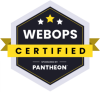

<!-- jahzlariosa — profile README -->

  

  

### About me

I'm a fullstack developer working across CMS platforms (Drupal, WordPress), modern web stacks (Next.js, React, Convex), mobile apps, and server management. I like building things that work well and are easy to maintain. Lately I've been actively exploring AI — working with LLM APIs and AI-assisted workflows, and building up my proficiency there.

### Stack

  
  
  

  

  
  

  
  
  

  
  

  

**Currently exploring:** AI-assisted development, LLM APIs, and RAG-style workflows.

  
  

### Stats

  
  

### Contributions

  

> Note: the snake is generated by `.github/workflows/snake.yml` in this repo — enable Actions once after pushing and it animates on its own.

### Connect

  

<!-- Add more as needed, e.g.:
  
  
-->

